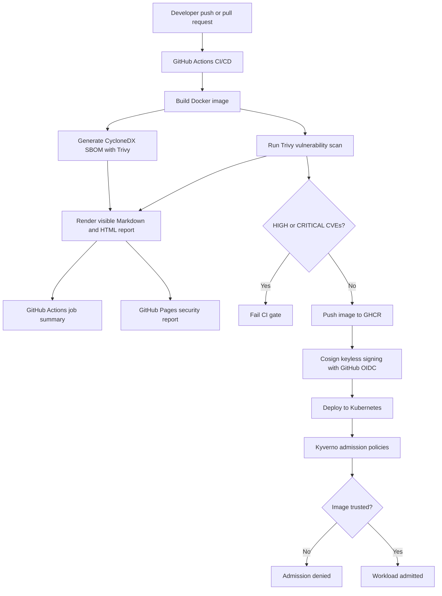

# LockBox Architecture

LockBox is a local-first zero-trust software supply chain prototype. It builds a container image, generates an SBOM, scans for vulnerabilities, signs the image with Sigstore Cosign, stores it in GitHub Container Registry, and uses Kyverno admission policies to block images that are unsigned or do not meet registry and tag rules.

## Security Controls

| Control | Tool |
| --- | --- |
| SBOM generation | Trivy |
| Vulnerability scanning | Trivy |
| Visible report | GitHub Actions summary + GitHub Pages |
| Image signing | Cosign |
| Keyless identity | GitHub OIDC + Sigstore |
| Container registry | GHCR |
| Admission control | Kyverno |
| Policy enforcement | Kyverno |

## Trust Policy

The cluster only accepts LockBox images from `ghcr.io`, blocks the `latest` tag, and verifies images signed by the GitHub Actions workflow identity.

## CI/CD Gates

The workflow generates machine-readable evidence first, then renders a human-readable report. The vulnerability gate fails the workflow when Trivy finds any HIGH or CRITICAL CVE. On `main`, the latest report is also published with GitHub Pages.
