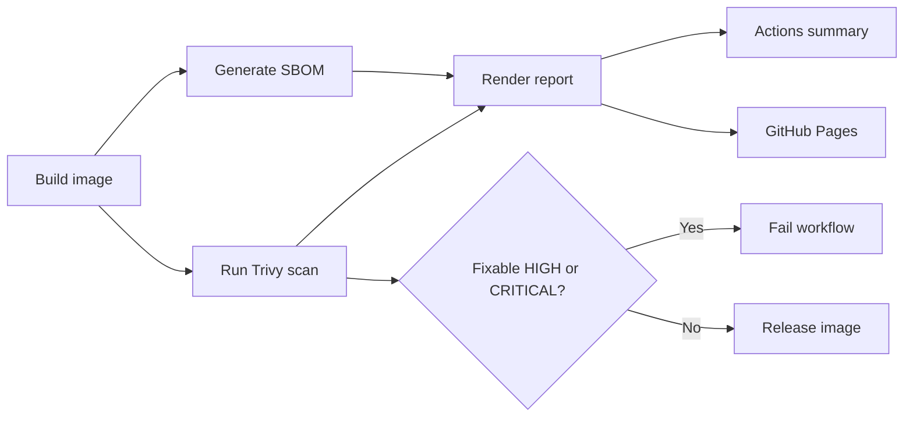

# Security Reporting

LockBox generates two kinds of report from the same Trivy evidence.

## Machine-Readable Evidence

| File | Purpose |
| --- | --- |
| `artifacts/sbom.json` | CycloneDX SBOM |
| `artifacts/scan-report.json` | Full Trivy vulnerability scan |

## Human-Readable Reports

| File | Purpose |
| --- | --- |
| `reports/security-report.md` | Markdown report for GitHub Actions summary |
| `public/index.html` | Static HTML report for GitHub Pages |

The GitHub Actions run also shows:

- A full Markdown report in the job summary.
- Error annotations for the top CRITICAL and HIGH CVEs.
- Warning annotations for lower-severity CVEs included in the top list.

## CI/CD Flow



The report still shows all vulnerabilities. The release gate blocks only HIGH or CRITICAL findings that have a fixed version available, using Trivy's `--ignore-unfixed` option. Unfixed vendor/base-image CVEs remain visible for review without blocking the release path.

## Local Report Generation

```bash
docker build -t lockbox:v1 app
scripts/generate-sbom.sh lockbox:v1
scripts/scan-image.sh lockbox:v1
```

Open `public/index.html` in a browser to view the report locally.
